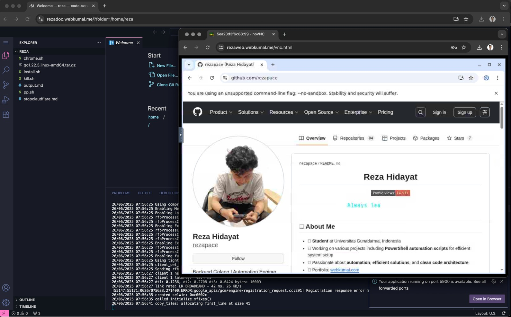

# Docker VSCode Chrome

Docker container yang berisi VSCode dan Chrome untuk development environment.



## Instalasi

### 1. Download File

Download semua bagian file zip:

```bash
curl -L -o vscode_chrome_2.zip.001 https://github.com/rezapace/my-docker/releases/download/v1.3/vscode_chrome_2.zip.001
curl -L -o vscode_chrome_2.zip.002 https://github.com/rezapace/my-docker/releases/download/v1.3/vscode_chrome_2.zip.002
curl -L -o vscode_chrome_2.zip.003 https://github.com/rezapace/my-docker/releases/download/v1.3/vscode_chrome_2.zip.003
curl -L -o vscode_chrome_2.zip.004 https://github.com/rezapace/my-docker/releases/download/v1.3/vscode_chrome_2.zip.004
```

### 2. Extract File

Gabungkan dan extract file zip:

```bash
cat vscode_chrome_2.zip.* > vscode_chrome_2.zip
unzip vscode_chrome_2.zip
```

### 3. Load Docker Image

```bash
docker load -i vscode_chrome.tar
```

### 4. Jalankan Container

```bash
docker run -d -p 6080:6080 -p 8443:8443 --name vscode_chrome vscode_chrome
```

## Akses

Setelah container berjalan, buka browser dan akses:

```
http://localhost:6080
```

## Fitur

- VSCode dengan ekstensi development
- Chrome browser untuk testing
- Environment development yang terisolasi
- Akses melalui web browser (noVNC)
- Clauflare zero trust